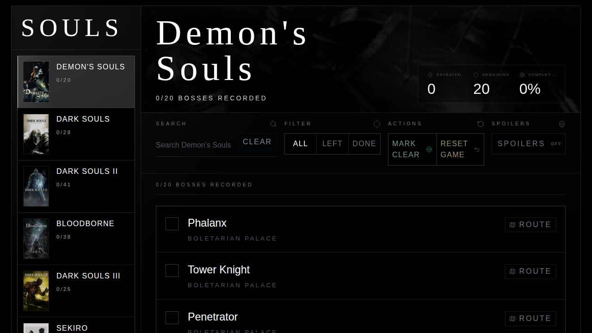
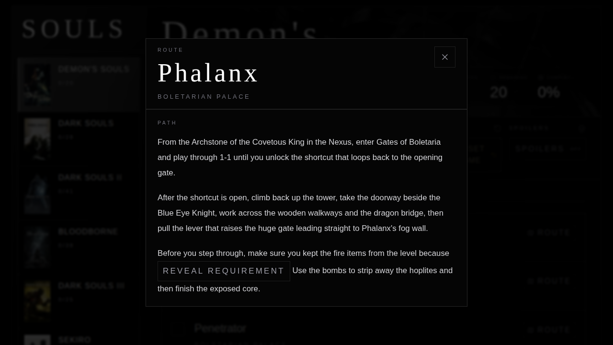

# Souls

Local-only Soulsborne boss checklist built for speed, clarity, and solid visual tone.

Deployed at https://souls.kaf.sh

## Preview



_Single-game view with the new rail navigation and local-only state._



_Search-driven filtering inside the currently selected game._

## What It Does

- Tracks boss completion across 7 FromSoftware games.
- Persists progress in `localStorage` with no accounts and no backend.
- Filters instantly by search text, remaining bosses, and cleared bosses.
- Supports per-game bulk actions and overall progress tracking.
- Ships as a fast static SPA behind a small Cloudflare Worker for headers and SPA routing.

## Pillars

- Performance: Solid + Vite, static assets, tiny runtime surface, no server round-trips for app state.
- Aesthetics: dark editorial UI with clear hierarchy, ambient gradients, and dense but readable lists.
- Data accuracy: generated boss data with refreshable source sync instead of hand-maintained drift.

## Stack

- Solid
- Vite
- Tailwind CSS v4
- Cloudflare Workers + Wrangler

## Data

Boss data lives in [`src/data/bosses.ts`](./src/data/bosses.ts) and is generated by [`scripts/sync-boss-data.mjs`](./scripts/sync-boss-data.mjs).

Refresh it with:

```bash
npm run sync-data
```

Current generated dataset: 434 bosses across:

- Demon's Souls
- Dark Souls
- Dark Souls II
- Bloodborne
- Dark Souls III
- Sekiro: Shadows Die Twice
- Elden Ring

## Development

Install dependencies:

```bash
npm install
```

Run the app locally:

```bash
npm run dev
```

Typecheck:

```bash
npm run typecheck
```

Build production assets:

```bash
npm run build
```

## Deploy

Deploy to Cloudflare:

```bash
npm run deploy
```

Wrangler configuration is in [`wrangler.jsonc`](./wrangler.jsonc). The Worker entrypoint is [`worker/index.ts`](./worker/index.ts).

## Notes

- All checklist data is stored in the browser under `souls-checklist:v1`.
- The app is intentionally backend-free for v1.
- The Worker adds SPA fallback behavior plus security and cache headers for deployed assets.
